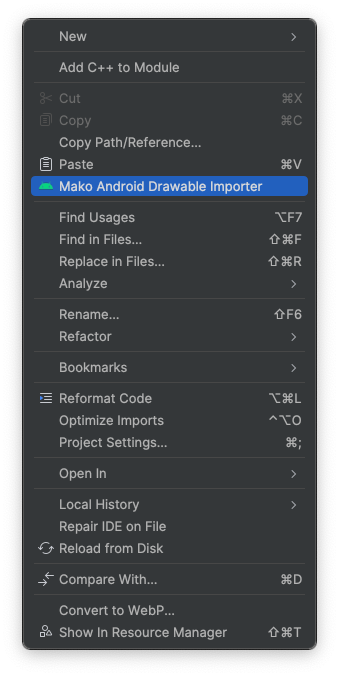
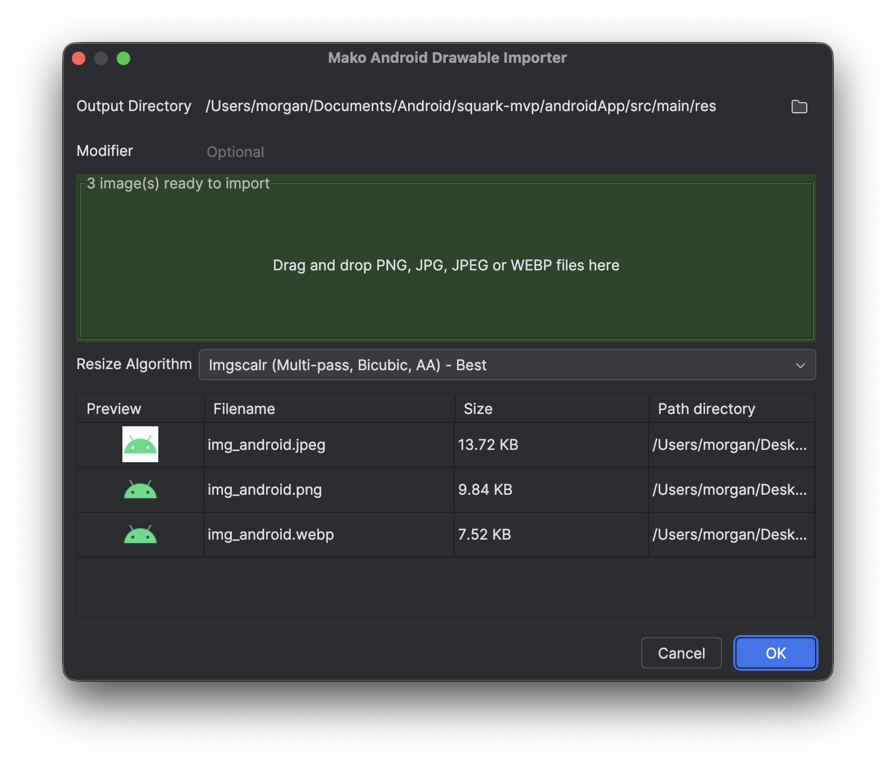
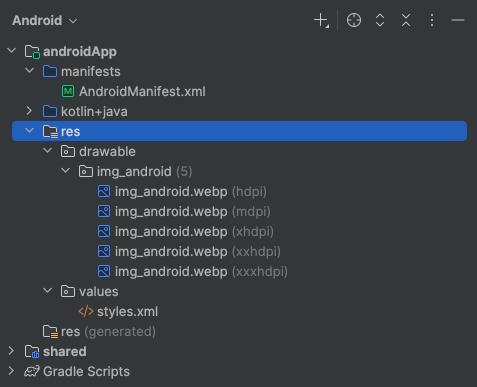

# 🐟 Mako — Android Drawable Importer Plugin for IntelliJ / Android Studio

> Still manually scaling images for Android drawable folders? Come on now. Mako is here to help.

## ✨ What Is This?

Mako is a no-nonsense, drag-and-drop image importer plugin for Android Studio and IntelliJ IDEA.  
It lets you import your `xxxhdpi` images and automatically scales them into the proper
Android [density-specific drawable directories](https://developer.android.com/training/multiscreen/screendensities)
like:

- `drawable-mdpi/`
- `drawable-hdpi/`
- `drawable-xhdpi/`
- `drawable-xxhdpi/`
- `drawable-xxxhdpi/`

Need a `drawable-night-xxhdpi` or `drawable-de-xxhdpi` instead? No problem — just enter a modifier.  
Drag in your `xxxhdpi` image(s) — and you’re done.

## 🧰 Features

- ✅ Drag and drop to import images
- ✅ Automatically scales `xxxhdpi` images down to all required densities
- ✅ Supports custom folder modifiers like `drawable-night-xxhdpi` or `drawable-zh-xxhdpi`
- ✅ Supports common formats: **PNG**, **JPG**, **JPEG**, and yes... **WebP!**
- ✅ Uses only **native Java libraries** for fast, dependency-free image scaling
- ✅ Multi-image batch import with **preview**
- ✅ Designed with simplicity for your **everyday Android developers**
- ✅ Open source and **friendly** ❤️
- ✅ Localised in:
    - English (`en`)
    - Chinese Simplified (`zh`)
    - Japanese (`jp`)
    - Spanish (`es`)
    - Portuguese (Brazil) (`pt-BR`)

## 📸 Screenshots

## 🚀 Installation

**Option 1 - JetBrains Plugin Marketplace**

[JetBrains Plugin Marketplace - Mako Android Drawable Importer](https://plugins.jetbrains.com/plugin/27961-mako-android-drawable-importer)

**Option 2 - Manual Installation via ZIP**

[Click here](https://github.com/delacrixmorgan/mako-intellij/release/download/mako-1.0.1.zip) to download the ZIP.

## 🧪 Supported Image Formats

- PNG
- JPG / JPEG
- WebP

> ❗ We wanted to support JPEG XL, but it’s still not widely supported on the JVM side (yet!). Keep an eye out though.

## 🛠 How It Works

1) Open your Android project and right-click on your `res` package, it will have `Mako Android Drawable Importer` just
   underneath `Paste`.
2) You provide a high-resolution `xxxhdpi` image.
3) Mako uses native ImageIO and BufferedImage (with optional WebP via TwelveMonkeys) to scale it down to the lower
   buckets.
4) It writes the resized images into proper drawable-* folders using your output directory and optional modifier.
5) Done. No manual resizing, no need to learn Photoshop and most of all no more crying.

## 🌍 Localisation

Want to help translate? PRs welcome!

Currently supported:

| Language       | Code  |
|----------------|-------|
| English        | en    |
| 中文 (简体)        | zh    |
| 日本語            | jp    |
| Español        | es    |
| Português (BR) | pt-BR |