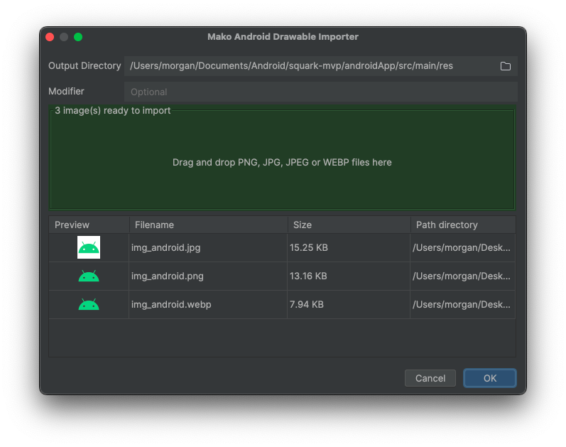

# 🐟 Mako — Android Drawable Importer Plugin for IntelliJ / Android Studio

> Still manually scaling images for Android drawable folders? Come on now. Mako is here to help.

## ✏️ Article

- [The Android Plugin I Couldn’t Live Without — So I Rebuilt It from Scratch](https://medium.com/bugless/the-android-plugin-i-couldnt-live-without-so-i-rebuilt-it-from-scratch-73adda89ddd3)

## ✨ What Is This?

Mako is a no-nonsense, drag-and-drop image importer plugin for Android Studio and IntelliJ IDEA.  
It lets you import your `xxxhdpi` images and automatically scales them into the proper
Android [density-specific drawable directories](https://developer.android.com/training/multiscreen/screendensities)
like:

- `drawable-mdpi/`
- `drawable-hdpi/`
- `drawable-xhdpi/`
- `drawable-xxhdpi/`
- `drawable-xxxhdpi/`

Need a `drawable-night-xxhdpi` or `drawable-de-xxhdpi` instead? No problem — just enter a modifier.  
Drag in your `xxxhdpi` image(s) — and you’re done.

## 🧰 Features

- ✅ Drag and drop to import images
- ✅ Automatically scales `xxxhdpi` images down to all required densities
- ✅ Supports custom folder modifiers like `drawable-night-xxhdpi` or `drawable-zh-xxhdpi`
- ✅ Supports common formats: **PNG**, **JPG**, **JPEG**, and yes... **WebP!**
- ✅ Choose between **three resize algorithms** (Native, Thumbnailator, Imgscalr) for optimal image quality
- ✅ Multi-image batch import with **preview**
- ✅ Designed with simplicity for your **everyday Android developers**
- ✅ Open source and **friendly** ❤️
- ✅ Localised in:
    - English (`en`)
    - Chinese Simplified (`zh`)
    - Japanese (`jp`)
    - Spanish (`es`)
    - Portuguese (Brazil) (`pt-BR`)

## 📸 Screenshots

## 🚀 Installation

**Option 1 - JetBrains Plugin Marketplace**

[JetBrains Plugin Marketplace - Mako Android Drawable Importer](https://plugins.jetbrains.com/plugin/27961-mako-android-drawable-importer)

**Option 2 - Manual Installation via ZIP**

[Click here](https://github.com/delacrixmorgan/mako-intellij/release/download/mako-1.0.1.zip) to download the ZIP.

## 🧪 Supported Image Formats

- PNG
- JPG / JPEG
- WebP

> ❗ We wanted to support JPEG XL, but it’s still not widely supported on the JVM side (yet!). Keep an eye out though.

## 🎨 Resize Algorithms

Mako offers three different resize algorithms, each with its own approach to image quality and performance. You can
select your preferred algorithm in the import dialog.

### Algorithm Comparison

**1. Native (Graphics2D)**

- Single-pass resize
- Interpolation method: Bilinear
- Fast and dependency-free

**2. Thumbnailator**

- Uses progressive downscaling (multiple passes when downscaling significantly)
- Interpolation method: Bicubic
- Good balance of speed and quality

**3. Imgscalr**

- Uses multiple passes to minimize quality loss
- Applies anti-aliasing and edge preservation
- Interpolation method: Bicubic
- Best quality, slightly slower

### Visual Comparison

| Native                                                                                                                          |                                                             Thumbnailator                                                             | Imgscalr                                                                                                                              |
|---------------------------------------------------------------------------------------------------------------------------------|:-------------------------------------------------------------------------------------------------------------------------------------:|---------------------------------------------------------------------------------------------------------------------------------------|
|  |  |  |

## 🛠 How It Works

1) Open your Android project and right-click on your `res` package, it will have `Mako Android Drawable Importer` just
   underneath `Paste`.
2) You provide a high-resolution `xxxhdpi` image.
3) Select your preferred resize algorithm (Native, Thumbnailator, or Imgscalr).
4) Mako scales the image down to the lower density buckets using your selected algorithm.
5) It writes the resized images into proper drawable-* folders using your output directory and optional modifier.
6) Done. No manual resizing, no need to learn Photoshop and most of all no more crying.

## 🌍 Localisation

Want to help translate? PRs welcome!

Currently supported:

| Language       | Code  |
|----------------|-------|
| English        | en    |
| 中文 (简体)        | zh    |
| 日本語            | jp    |
| Español        | es    |
| Português (BR) | pt-BR |

## 🤝 Contributing

Thanks for your interest in contributing! 🎉
We welcome code contributions, bug reports, feature requests, documentation improvements, and ideas.

You can help in many ways:
- 🐛 Report bugs (or help fix them!)
- ✨ Suggest new features or improvements
- 📝 Improve documentation
- 🔧 Submit pull requests
- 💬 Ask questions or discuss ideas

## 📄 License

This project is licensed under the GNU General Public License v3.0 - see the [LICENSE.md](LICENSE.md) file for details.